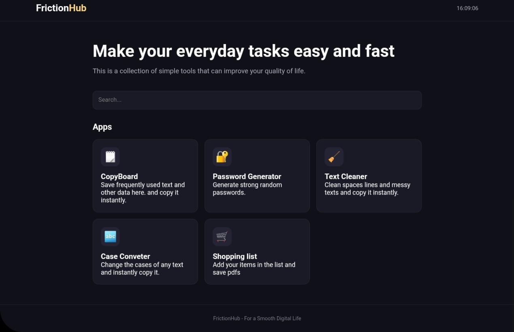

# FrictionHub
---

---
FrictionHub is a collection of lightweight, easy-to-use web tools designed to make everyday digital tasks faster and more convenient.

## Features
- CopyBoard
Save frequently used text and quickly copy it whenever you need it.
- Password Generator 
Generate strong and random passwords for improved account security.
- Text Cleaner
Clean up messy text by removing unnecessary spaces and fixing unwanted line breaks.
- Case Conveter 
Convert text between different letter cases quickly and easily.
- Shopping List
Create and manage shopping lists and save them as PDF files.
---
#### Any of your data entered in this never leaves your device/browser tab.
---
## Built with
- HTML
- CSS
- JS
- GITHUB PAGES
---
### Goal
Reduce the small digital frustrations we experience every day.
---
## Note for shipwrights
This app is not at all vibe coded it is completely done by me it self. So please completely check all the codes. 
---
#### Live Link
https://frictionhub.devlkakkoth.me
